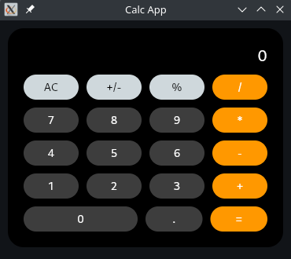

# Calculatorv0.0.1

---

---

**Calculator** - app for calculate numbers (just a common calculator).

---

## Help:

### How to start:

- Clone project
- Create venv in project: `python -m venv venv`
- Activate venv: `source venv/bin/activate`

---

### Run:

`python app.py`

---

---

### If you had troubles with flet, use:

### Manjaro:

- `pip install -r requirements.txt`
- `sudo pacman -S mpv`
- `sudo ln -s /usr/lib/libmpv.so /usr/lib/libmpv.so.1`